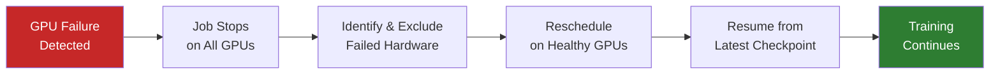

import ConceptCheck from '@site/src/components/ConceptCheck';
import Scenario from '@site/src/components/Scenario';
import FlopCalculator from '@site/src/components/FlopCalculator';
import KeyNumber, {KeyNumberRow} from '@site/src/components/KeyNumber';

# Chapter 03: Cluster Management

> *Schedulers, orchestration, health monitoring, and the software that turns thousands of individual GPUs into a single coherent training system.*

## The Coordination Problem

A modern training run uses thousands of GPUs executing a single computation in parallel. Unlike traditional HPC workloads or web services, large-model training has a distinctive property: **every GPU must stay in lockstep**. If one GPU falls behind, every other GPU waits. If one GPU fails, the entire job must checkpoint and restart.

This creates a fundamentally different management challenge than running a web service where individual server failures are invisible to users.

### Why Lockstep Matters

In data-parallel training — the most common parallelism strategy — every GPU holds a copy of the model and processes a different batch of data. After each forward and backward pass, all GPUs must synchronize their gradients via an **all-reduce** operation before any GPU can proceed to the next step.

This means the slowest GPU in the group determines the throughput of the entire cluster. A single GPU running 10% slower (due to thermal throttling, a degraded NVLink, or a slow memory module) slows down every other GPU by the same 10%. At 10,000 GPUs, you're only as fast as your weakest node.

This lockstep property has profound implications:
- **Hardware homogeneity is critical.** Mixing GPU generations or configurations within a training job creates persistent stragglers.
- **Health monitoring must be proactive.** You need to detect degraded (not just failed) hardware before it drags down the entire job.
- **Network performance is collective.** A single congested link in the all-reduce communication path slows every GPU.

## Compute Estimation

Before scheduling a training job, operators need to estimate its compute requirements. Use the calculator below to explore how model size, dataset size, GPU type, and cluster size interact:

<FlopCalculator />

The **6ND rule** (6 × parameters × tokens = total FLOP) is the standard approximation for the compute required for a single training pass. The factor of 6 comes from: 2 FLOP per parameter for the forward pass, 4 FLOP per parameter for the backward pass (computing gradients requires roughly 2x the forward pass compute, plus the parameter update).

**Model FLOP Utilization (MFU)** is the fraction of theoretical GPU peak that you actually achieve during training. Real-world MFU ranges from 30-55% for large training runs. The gap comes from:
- Communication overhead (all-reduce, pipeline bubbles)
- Memory bandwidth limitations
- Kernel launch overhead
- Imperfect parallelism strategies

Getting MFU from 40% to 50% on a 10,000-GPU cluster is equivalent to getting 1,000 more GPUs for free. This is why cluster management and communication optimization receive enormous engineering investment.

<ConceptCheck
  question="A 70B parameter model is being trained on 2 trillion tokens. Using the 6ND approximation, approximately how many total FLOP does this training run require?"
  options={[
    {label: "(a) 8.4 × 10²² FLOP", correct: true},
    {label: "(b) 1.4 × 10²³ FLOP"},
    {label: "(c) 1.4 × 10¹⁴ FLOP"},
    {label: "(d) 4.2 × 10²³ FLOP"},
  ]}
  explanation="6 × 70 × 10⁹ × 2 × 10¹² = 8.4 × 10²³ FLOP. At 40% MFU on 1,024 GB200 GPUs (each at 2.25 PFLOPS), effective throughput is ~921 PFLOPS = 9.21 × 10¹⁷ FLOP/s. Training time: 8.4 × 10²³ / 9.21 × 10¹⁷ ≈ 912,000 seconds ≈ 10.6 days. This matches the order of magnitude for real-world large model training."
/>

## Job Scheduling

### Cluster Schedulers

Large AI clusters use specialized schedulers to allocate GPUs to training jobs. Common systems include:

- **Slurm** — The dominant HPC scheduler, widely used in academic and government clusters. Allocates nodes, manages queues, handles job dependencies.
- **Kubernetes + custom operators** — Increasingly used in cloud and enterprise settings. Projects like Volcano and KubeFlow add GPU-aware scheduling to Kubernetes.
- **Proprietary schedulers** — Large labs (Google, Meta) often run custom systems optimized for their specific hardware and workload patterns.

The key scheduling constraint for training jobs is **topology-aware placement**. A 1,024-GPU training job doesn't just need any 1,024 GPUs — it needs GPUs that are topologically close in the network fabric to minimize communication latency. Placing a job across two different SuperPODs when it could fit in one dramatically increases all-reduce latency.

### Scheduling Complexity in Practice

Real scheduling is harder than "assign GPUs to jobs" for several reasons:

**Fragmentation:** After running several different-sized jobs, the cluster often has free GPUs scattered across multiple racks and SuperPODs. A large job may need to wait for a contiguous allocation even though enough total GPUs are free. This is the **bin packing problem** applied to topology-constrained resources.

**Priority and preemption:** Production training runs typically have highest priority but take days or weeks. Research and experimentation jobs need quick turnaround. Most clusters implement priority queues with preemption — a high-priority job can evict lower-priority jobs. The evicted job checkpoints and re-queues.

**Maintenance windows:** Individual nodes need periodic maintenance (firmware updates, coolant filter changes, hardware replacement). The scheduler must drain nodes gracefully without killing long-running jobs unnecessarily.

<ConceptCheck
  question="A cluster has 2,048 GPUs across two SuperPODs (1,024 each). A training job requires 1,500 GPUs. Why is this scheduling scenario particularly difficult?"
  options={[
    {label: "(a) The cluster doesn't have enough GPUs"},
    {label: "(b) The job must span both SuperPODs, incurring cross-SuperPOD communication latency for every gradient synchronization step", correct: true},
    {label: "(c) Slurm can't handle jobs larger than 1,024 GPUs"},
    {label: "(d) The job needs more memory than 1,500 GPUs can provide"},
  ]}
  explanation="The job needs 1,500 GPUs but no single SuperPOD has more than 1,024, so it must span both. Every all-reduce synchronization step now includes cross-SuperPOD traffic, which has higher latency than intra-SuperPOD communication. A topology-aware scheduler would flag this and either (a) wait for a better placement if possible, or (b) configure the collective communication library to account for the topology. This is why scheduling for training is fundamentally harder than scheduling for inference — placement quality directly impacts job performance."
/>

## Health Monitoring and Failure Recovery

### Failure Rates at Scale

At the scale of modern training clusters, hardware failures are not exceptional events — they're a constant background condition. With thousands of GPUs, each containing billions of transistors plus memory, interconnects, and power delivery, component failures happen regularly.

Published data from large-scale training runs gives us a sense of the failure landscape:

<KeyNumberRow>
  <KeyNumber value="~1 hr" label="Cluster MTBF" context="10,000-GPU cluster" />
  <KeyNumber value="10,000+ hrs" label="Single GPU MTBF" context="Individual component" />
  <KeyNumber value="30-55%" label="Typical MFU" context="Model FLOP Utilization" />
</KeyNumberRow>

- **Mean time between failure (MTBF)** for a 10,000-GPU cluster is measured in hours, not days. Individual GPUs may have MTBF of 10,000+ hours, but with 10,000 of them running simultaneously, the cluster MTBF is roughly 1 hour.
- **Silent data corruption** — GPUs producing wrong results without reporting errors — is a growing concern. It's been documented by both Meta and Google in large-scale runs. These are the hardest failures to detect because the job keeps running but produces garbage gradients.
- **Cascading failures** are common in tightly coupled systems. A failed power supply can take down a node, which triggers a checkpoint-and-restart for the job, which creates a burst of storage I/O, which can cause other jobs to slow down.

Common failure modes include:
- **GPU errors** — Uncorrectable ECC errors in HBM, thermal throttling, hardware faults
- **Network link failures** — InfiniBand cable degradation, switch port failures, connector issues
- **Node-level failures** — PSU failures, DIMM errors, NVLink errors, OS crashes
- **Cooling anomalies** — Coolant flow disruptions, pump failures, leak detection

### Checkpointing

Because a single GPU failure stops the entire training job, large training runs use periodic **checkpointing** — saving the complete model state (weights, optimizer state, learning rate schedule position) to persistent storage at regular intervals.

When a failure occurs:

1. The job stops on all GPUs.
2. The failed hardware is identified and excluded.
3. The job is rescheduled on healthy hardware (possibly with a different GPU allocation).
4. Training resumes from the most recent checkpoint.

The time between the last checkpoint and the failure is lost compute. This makes checkpoint frequency an important optimization parameter: too frequent and you waste time writing checkpoints; too infrequent and you lose more compute when failures occur.

### Checkpoint Engineering

Checkpointing sounds simple — save model weights to disk — but at scale it's a serious engineering challenge:

- **Checkpoint size** for a 70B parameter model is roughly 140 GB (weights only) to 1+ TB (full optimizer state). For a 400B+ model, checkpoints can exceed 10 TB.
- **Writing speed** is critical. If a checkpoint takes 10 minutes to write and you're checkpointing every 30 minutes, you're spending 33% of your time on I/O. Parallel filesystems (Lustre, GPFS) and NVMe burst buffers are used to minimize write time.
- **Asynchronous checkpointing** — writing checkpoints in the background while training continues — is becoming standard. The GPU copies its state to CPU memory, then a background process writes to storage while the next training step begins.
- **Incremental checkpointing** saves only the changed portions of state, reducing write volume. This is harder to implement correctly but can reduce checkpoint time significantly.

<ConceptCheck
  question="A training run checkpoints every 30 minutes. If the mean time between failures across the entire cluster is 4 hours, approximately what fraction of compute is lost to failure recovery (ignoring checkpoint writing time)?"
  options={[
    {label: "(a) ~6% — about 15 minutes lost per 4-hour interval", correct: true},
    {label: "(b) ~12.5% — about 30 minutes lost per 4-hour interval"},
    {label: "(c) ~50% — half the time is spent recovering"},
    {label: "(d) Negligible — checkpoint recovery is instant"},
  ]}
  explanation="With 30-minute checkpoint intervals and a failure every 4 hours on average, each failure loses on average 15 minutes of compute (half the checkpoint interval, since the failure is equally likely at any point). Over 4 hours (240 minutes), 15 minutes is ~6%. In practice, the actual overhead is higher because checkpoint writing itself takes time, job restart has overhead, and failure detection isn't instant. At scale, teams obsess over reducing this overhead."
/>

## Observability Stack

Monitoring a large training cluster requires instrumentation at every level:

| Layer | What's Monitored | Tools |
|-------|-----------------|-------|
| GPU | Temperature, power draw, memory utilization, SM activity, ECC errors | DCGM, nvidia-smi, custom exporters |
| Node | CPU, system memory, disk I/O, NVLink status | Prometheus node_exporter, custom agents |
| Network | Link utilization, error counters, congestion signals | UFM (InfiniBand), SmartNIC telemetry |
| Job | Throughput (tokens/sec), loss curves, gradient norms | Training framework metrics, W&B, custom |
| Facility | Power draw, coolant temperature, flow rates | BMS (Building Management System), IPMI/BMC |

### What Good Monitoring Looks Like

The best-run clusters don't just collect metrics — they correlate them across layers. A training slowdown might manifest as:
- **Job layer:** tokens/sec drops by 15%
- **Network layer:** one IB link showing elevated error counters
- **Node layer:** one node's NVLink bandwidth is degraded
- **GPU layer:** that node has a GPU with rising ECC correctable error count

The operator who can traverse this chain from symptom to root cause in minutes (not hours) keeps training throughput high. This is why observability engineering is one of the highest-leverage roles in AI infrastructure.

### Automated Remediation

At sufficient scale, human operators can't respond to every failure in time. Automated systems handle common scenarios:

- **Automatic node drain:** When a GPU reports uncorrectable ECC errors, the monitoring system marks the node as unhealthy and notifies the scheduler to avoid placing new jobs there.
- **Automatic job restart:** When a training job fails, the scheduler automatically restarts it from the latest checkpoint on healthy hardware.
- **Preemptive migration:** Some systems detect degrading hardware (rising error rates, thermal trends) and preemptively migrate workloads before failure occurs.

This telemetry data is valuable for both operations and verification. It can reveal whether a cluster is actually running the workload it claims to be running — a topic we explore in depth in [Chapter 04](/docs/verification).

<Scenario
  title="Diagnosing a training slowdown"
  prompt="You're operating a 4,096-GPU training run. Over the last 12 hours, training throughput (measured in tokens processed per second) has gradually declined by 15%. No hardware failures have been reported by the monitoring system."
  questions={[
    "What are the most likely causes of a gradual throughput decline without reported hardware failures?",
    "What telemetry would you examine first, and in what order?",
    "How could this scenario be relevant to verification — i.e., how could you distinguish a legitimate slowdown from deliberate resource diversion?",
  ]}
  hints={Common causes of gradual degradation include: thermal throttling (GPU temperatures creeping up due to cooling system degradation or ambient temperature changes), network congestion from a competing job on shared fabric, a degrading but not yet failed IB link causing retransmissions, or memory errors that trigger slower ECC correction paths. For verification, the key question is whether the telemetry data is self-consistent — does the power draw match the claimed workload? Does the network traffic pattern match the expected collective communication of the training job? Deliberate diversion would likely show inconsistencies in these cross-checks.}
/>

---

*Next: [Chapter 04 — Verification Relevance](/docs/verification) — what all of this means for AI governance and safety verification.*
